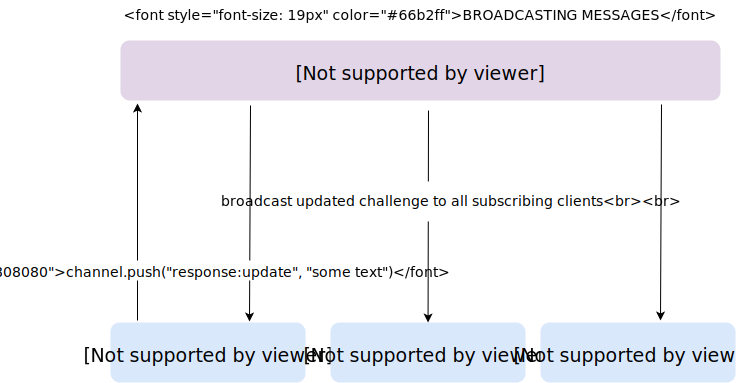

# Building Real-Time Features with Phoenix Channels and Presence
In this post we'll take a deep dive into Phoenix Channels by building a real-time collaborative text-editing feature. Then, we'll use the Phoenix Presence module to track user activity within that feature. 

## The App

We're building out a Phoenix app that allows users to collaborate on coding challenges. Users can visit "challenge rooms" and see a code challenge prompt along with an in-browser code editor. Users can collaborate on the code challenge by typing into the text editor. 

Here's where our real-time feature comes in. All of the users in the challenge room should be able to see what a given user is typing *as they are typing it*. We'll leverage Phoenix Channels to support this functionality. 

However, not only should they see *what* a user is typing, they should see an indication of *who* is typing it. This is where our need to track user state comes in. We'll use Phoenix Presence to build out this behavior. 

Here's a look at the final product we're going for:

VIDEO HERE.

Before we get started, let's take a brief look at our domain model. 

### The Domain Model

Our app is pretty simple (so far). We have a User model and table and a Challenge model and table. A challenge consists of a prompt and a response. 

A user can come and go from a challenge room, so there isn't an enforced relationship between users and challenges. In other words, user's do not belong to challenges or vice versa. 

## What are Phoenix Channels?

[Phoenix Channels](https://hexdocs.pm/phoenix/channels.html) are the perfect fit for real-time features. Channels allow us to establish bi-directional communication between message senders and receivers. 
  
  > Channels are based on a simple idea - sending and receiving messages. Senders broadcast messages about topics. Receivers subscribe to topics so that they can get those messages.

Phoenix Channels are actually made up of a number of components that work together to implement real-time web features across a distributed system. We'll be working with each of these components as we build out our feature.

## How Do Phoenix Channels Work?

There are two pieces to the Phoenix Channel puzzle: 

* Establishing a socket connection between client and server
* Broadcasting messages between senders and recipients

### Establishing the Socket Connection

The client will begin by connecting to a socket via one of two transport mechanisms: WebSockets or long polling. We'll stick with WebSockets for out implementation. 

Once the client has connected to the socket, it uses that network connection to join a channel. Phoenix Channels will create one server process per topic for a given client. 

When a client successfully establishes this connection, Phoenix Channels initializes an instance of `%Phoenix.Socket{}`. The channel server then retains awareness of this `socket` instance and maintains state within that instance via calls to `socket.assign` (more on that later).

### Broadcasting Messages

A client connected to a channel via a socket will sent send a message to the server via the channel. Once the message is received by the channel server, it is broadcasts out to the local PubSub server. This server in turn sends the message to any clients connected to the same channel topic on the same server. Then the PubSub server forwards the message to any remote PubSub servers running on other nodes in the cluster, which send the message out to their own subscribing clients. 


Now that we have a basic idea of what Phoenix Channels are and how they work, we're ready to start building!

## Implementing Phoenix Channels

In order to get our real-time collaborative text-editing feature working, we need to:

1. Declare a WebSocket endpoint that knows how to receive and handle WebSocket requests
2. Teach our client how to initialize a WebSocket connection
3. Teach our client how to join a specific channel
4. Teach our client how to broadcast a message across that channel

Let's get started.

### Step 1: Declare a WebSocket Endpoint

When you generate a new Phoenix app, your app's endpoint gets generated for you for free. 

The [application endpoint](https://hexdocs.pm/phoenix/Phoenix.Endpoint.html) acts as the starting point for all requests to your web app. 

```elixir
defmodule PhoenixPair.Endpoint do
  use Phoenix.Endpoint, otp_app: :phoenix_pair

  socket "/socket", PhoenixPair.UserSocket
end
```

This line is where the magic happens:

```elixir
socket "/socket", PhoenixPair.UserSocket
```

Here, we are declaring a socket on the `/socket` URI and telling our app that the `UserSocket` module will handle all such connection requests. 


#### Routing Socket Requests to Channels

Our application generation also gave us the `UserSocket` module for free in `/channels/user_socket.ex`.

The `UserSocket` is responsible for making sure our socket requests get routed to the correct channel:

```elixir
defmodule PhoenixPair.UserSocket do
  use Phoenix.Socket

  channel "challenges:*", PhoenixPair.ChallengeChannel
end
```

Now, whenever a client sends a message whose topic starts with "challenges:", it will be routed to our `ChallengeChannel`. 

Now that our socket endpoint is up and running, let's tell our client to open a socket connection.

### Step 2: Connecting a Client to the Socket

We'll have our client send a socket connect request to the socket endpoint. Then, the endpoint will forward that request to `UserSocket`, which will establish the connection. 


#### Sending the Connect Request From the Client

Phoenix Channels provides a JavaScript offering that we can use to send a socket connection request from the client.


```javascript
import { Socket } from 'phoenix';
const socket = new Socket("/socket", {params: {token: <your auth token>}})
socket.connect();
```

Calling `socket.connect()` on the front-end sends a request to our `/socket` endpoint, which routes the request to our `UserSocket` module.

#### Handling the Connect Request on the Server

The `UserSocket` module receives the connect request and invokes the `connect` function with an argument of the params that we passed to our `Socket` initialization. 


This `connect` function is where we perform some authorization actions. 

```elixir
# user_socket.ex
defmodule PhoenixPair.UserSocket do
  use Phoenix.Socket
  alias PhoenixPair.{GuardianSerializer}

def connect(%{"token" => token}, socket) do
    case Guardian.decode_and_verify(token) do
      {:ok, claims} ->
        case GuardianSerializer.from_token(claims["sub"]) do
          {:ok, user} ->
            {:ok, assign(socket, :current_user, user)}
          {:error, _reason} ->
            :error
        end
      {:error, _reason} ->
        :error
    end
  end
end
```

This particular app uses JWT to auth between the front- and back-ends. [Guardian](https://github.com/ueberauth/guardian) is a JWT-based authentication library that we can include in our Phoenix app. We're not going to focus too much on that here. It's enough to understand that we're leveraging the Guardian library to decode a JWT token and find our user.

Our `connect` function decodes the token from the params, finds the user from the database and then _stores that user in the socket's state_. Here's the how:

```elixir
assign(socket, :current_user, user)
```

Later on, we'll be able to access this `socket` instance in our channel and identify the current via `socket.assigns.current_user`.

### Step 3: User Joins a Channel

Now that we've connected to our socket, we can join a channel with a given topic. Here'w how it will work:

1. The client will send a join request. 
2. The join request will get routed by `UserSocket` to the `ChallengesChannel`. 
3. The `ChallengesChannel` will invoke it's own `join` function which will find the challenge with the given ID in the database and return it to the client. 

 

Let's take a look at the first step, sending the join request from the client. 

#### Sending the Join Request from the Client

```javascript
import { Socket }   from 'phoenix';

...
const channel = socket.channel(`challenges:${challengeId}`);
channel.join().receive('ok', (response) => {
  // do something like display the content of response.challenge
});
```

Here we've joined a challenge channel with a topic of the given challenge ID. This sends the request that gets routed via the `UserSocket` to the `ChallengesChannel`, which in turn invokes its `join` function. Let's take a look.

#### Handling the Join Request on the Server

```elixir
defmodule PhoenixPair.ChallengeChannel do
  use PhoenixPair.Web, :channel

  def join("challenges:" <> challenge_id, _params, socket) do
    challenge = get_challenge(challenge_id)
    socket    = assign(socket, :challenge, challenge)
    response  = %{challenge: challenge}
    {:ok, response, socket}
  end
```

The `join` function does a few things for us:
* Fetches the challenge with the given ID via the `get_challenge` function (not shown here). 
* Stores the current challenge in the `socket`'s state via a call to `assign`. 
* Constructs the response body to send back to the client
* Responds to the client with `{:ok, response, socket}`

Our client can then use the response body to display the current challenge to the user who just joined this challenge channel.

Now that the user has joined the channel, we're ready to build out the next facet of our real-time feature: a user typing into the shared text editor.

### Step 4: Broadcasting Messages

When a user types into the shared text editor for a given code challenge, we need to do three things:

1. Send a message from the client to the server via the channel.
2. Teach the client to respond to this message by: updating the challenge's response in the database and broadcasting the updated challenge message to all of the subscribers. 
3. Teach the subscribing clients to handle the broadcast of the message.




#### Sending a Message From the Client

We need to push a message to our channel whenever someone types into the text editor to update the challenge's response. We can do that on the client side by listening to keystrokes in the text area and invoking the following:

```javascript
// where codeResponse is the updated content of the text area
channel.push("response:update", {response: codeResponse})
```

#### Handling the Message On the Server

In order to handle this action in our `ChallengeChannel`, we need to define a `handle_in` function with an arity that pattern matches to the `"response:update"` message our client is sending:

```elixir
# challenge_channel.ex

def handle_in("response:update", %{"response" => codeResponse, "user_id" => user_id}, socket) do
  case Challenge.update(socket.assigns.challenge, codeResponse) do
    {:ok, challenge}
       ->
      broadcast! socket, "response:updated", %{challenge: challenge}
      {:noreply, socket}
    {:error, changeset} ->
      {:reply, {:error, %{error: "Error updating challenge"}}, socket}
  end
end
```

Here's where our earlier storage of the current channel within our socket's state pays off. We can retrieve the current challenge by calling `socket.assigns.challenge`. Then, we update that challenge in the DB with our new response--whatever the user typed into the shared text editor in the browser. 

Lastly, we want to broadcast out the newly updated challenge to all of our subscribing clients. We do that with the following line:

```elixir
broadcast! socket, "response:updated", %{challenge: challenge}
```

#### Handling the Message Broadcast

Handling the receipt of this broadcast on the front-end is easy. We tell our `channel` object to listen for the `"response:updated"` message. When it receives that message, it will invoke a callback function with an argument of the payload we broadcasted, i.e. the updated challenge. 

```javascript
channel.on("response:updated", (response) => {
  // do stuff with response.challenge
})
```

And that's it! Now that we've build out our challenge channel and starting broadcasting messages, we're ready to move on to part II: tracking user presence in the channel. 

## Using Phoenix Presence to Track User State

### Why Do We Need to Track User State?

We already have the ability for users to broadcast messages to all of the clients subscribing to a channel. But we want to give our users awareness of who these clients are. We want to list out the people currently in a given "challenge room" *and* we want to indicate which user is currently typing into the shared text editor. 

We'll use Phoenix Presence to store and expose this user-state-related info. 

### Phoenix Presence
The Phoenix Presence module allows us to:

* Store and expose topic-specific information to all of a channel's subscribing clients, across all of our application's distributed nodes. 
* Store that information in a resilient and de-centralized manner.
* Broadcast presence-related events and handle them on the front-end with ease. 

### How Does Phoenix Presence Work?

Presence uses a Conflict-Free Replicated Data Type (CRDT) to store and broadcast topic-specific information to all channels with a given topic. Unlike a centralized data store like Redis, Phoenix Presence has no single point of failure and no single source of truth. This allows the Presence data store to be self-healing and replicable across all of the nodes of your application cluster. 

Now that we're convinced that Phoenix Presence is the right fit for us, we'll use it to do two things:

* Display a list of present users in a given "challenge room"
* Indicate which of these present users is currently typing in the shared text-editor.

### Setting Up Phoenix Presence

Incorporating Phoenix Presence in our app is easy. We need to:

* Define a module that uses Presence
* Include that module in our supervisor tree

We'll define our module `ChallengePresence` in `lib/phoenix_pair`. We'll tell our module to `use` the `Phoenix.Presence` module and we'll provide our module with access to our OTP app and PubSub server.

```elixir
defmodule PhoenixPair.ChallengePresence do
  use Phoenix.Presence, otp_app: :phoenix_pair,
                        pubsub_server: PhoenixPair.PubSub

  alias PhoenixPair.{ChallengePresence}
end
```

Then, we'll include it in our supervisor tree in our application config:

```elixir
lib/phoenix_pair.ex

defmodule PhoenixPair do
  use Application

  def start(_type, _args) do
    import Supervisor.Spec

    children = [
      supervisor(PhoenixPair.Repo, []),
      supervisor(PhoenixPair.Endpoint, []),
      supervisor(PhoenixPair.ChallengePresence, []))
    ]

    opts = [strategy: :one_for_one, name: PhoenixPair.Supervisor]
    Supervisor.start_link(children, opts)
  end
```

Now we're ready to start using our module to track user presence. 


### User Joins a Channel

We want to use Phoenix Presence to track is the list of present users in a challenge channel. So, when a user joins a challenge channel, we will add them to Presence's list of present users. Then, we'll use Presence to make that list available to both the client who just joined _and_ the existing subscribers. 

Our `ChallengeChannel` already has a `join` function that fires when a user joins the channel. We'll define an `after_join` function where we'll call on Presence to add this user to list. 

```elixir
defmodule PhoenixPair.ChallengeChannel do
  use PhoenixPair.Web, :channel
  alias PhoenixPair.ChallengePresence


  def join("challenges:" <> challenge_id, _params, socket) do
    challenge = get_challenge(challenge_id)
    send(self, {:after_join, challenge})
    ...
  end

  def handle_info({:after_join, challenge}, socket) do
    # store user in our Presence store
    # broadcast out the new list of users to subscribers
    # send the list of existing users to the newly joined client
  end
end
```

Our `after_join` function has three jobs to do:

 * store user in our Presence store
 * broadcast out the new list of users to subscribers
 * send the list of existing users to the newly joined client

#### Adding the User to the Store


Let's start with job #1, adding the user to the list of users in our Presence store. 

We'll build a function, `track_user_join` in our `ChallengePresence` module that allows us to do just that. 

```elixir
# challenge_presence.ex
def track_user_join(socket, user) do
  ChallengePresence.track(socket, user.id, %{
    typing: false,
    first_name: user.first_name,
    user_id: user.id
  })
end
```

The `track_user_join` function is really just a wrapper for a Phoenix Presence function `track`. The `track` function takes in a few arguments:

* The socket whose topic (in our case, challenge ID) we want to store information for
* The user ID we want to mark as present in our channel
* A map of metadata that will be stored under this user ID

This will create a store with the following structure:

```elixir
%{
  "1" => %{
    metas: [%{
      typing: false, 
      first_name: "Sophie", 
      phx_ref: "xxxx"
    }]
  },
   "2" => %{
    metas: [%{
      typing: false, 
      first_name: "Antoin", 
      phx_ref: "xxxx"
    }]
  }
}
```

We'll call on our `ChallengePresence.track_user_join` function in our channel's after join function. We'll pass in an argument of the socket and the current user ID. You maybe remember that we stored our current user in our socket. That means we can access that user via `socket.assigns.current_user`. 

```elixir
# challenge_channel.ex

def handle_info({:after_join, challenge}, socket) do
  ChallengePresence.track_user_join(socket, socket.assigns.current_user)
end
```

Now that the user is added to the Presence store, we want to broadcast the updated list of users to all of the subscribing clients. 

#### Broadcasting the Presence List: The Presence Diff Event
In order to broadcast our list of present users to all of the subscribing clients, we have to...do nothing!

Calling `Presence.track` will automatically send a `presence_diff` event to all of the subscribing clients. It will send this event with a payload of the list of present users, grouped under top-level keys of `"joins"` and `"leaves"`

```javascript
%{  
    joins: %{
      "1" => %{
        metas: [%{
          typing: false, 
          phx_ref: "xxxx", 
          first_name: "Sophie"
        }]
      }
    },
    leaves: %{
      "2" => %{
        metas: [%{
          typing: false, 
          phx_ref: "xxxx", 
          first_name: "Antoin"
        }]
    }
  }
```

#### Handling the Broadcast on the Client-Side

We just need to teach our clients how to respond to that event. Phoenix Presence has a nice client-side offering which helps us update and display our list of present users when we receive the above payload from the server. 

```javascript
import { Socket, Presence } from 'phoenix';

let presences = []
channel.on("presence_diff", (response) => {
  presences = Presence.syncDiff(presences, response);
  let participants = Presence.list(presences).map(p => {participants.push(p.metas[0])})
})
```

The `Presence.syncDiff` function takes in the list of current present users and reconciles them with any users that left or joined. 

The `Presence.list` function returns an array of present users and their metadata. 

These two functions make updating and displaying our list of current users on the front-end a total breeze.

#### Sending the List of Existing Users to the New Client

The broadcast of the newly updated list of users will get sent to all of the clients who were _already_ subscribing to the channel. What about the new user who just joined? How will this client get the list of people who were already present in the channel?

For this, we'll need to push out a response to _just the client who initiated the join event_. This response should include a list of the present users. Once again we'll handle this in the `after_join` function of our `ChallengeChannel`. 

```elixir
# challenge_channel.ex

def handle_info({:after_join, challenge}, socket) do
  ChallengePresence.track_user_join(socket, socket.assigns.current_user)
  push socket, "presence_state", ChallengePresence.list(socket)
end
```

Here, we're pushing the `"presence_state"` event to only the client who sent the join request. And we're sending that event with a payload of the list of present users, courtesy of the `Presence.list` function. The `list` function (you guessed it) returns the list of present users and their metadata. 

We can handle this on the front-end with very little code, thanks once again to the Presence client-side library. 

```javascript
import { Socket, Presence } from 'phoenix';

let presences = []
channel.on("presence_state", (response) => {
  presences = Presence.syncDiff(presences, response);
  let participants = Presence.list(presences).map(p => {participants.push(p.metas[0])})
})
```

It's pretty much the exact same code we used to handle the broadcast of present users to existing subscribers. The only difference is that this time we're listening for the `"presence_state"` event. 

### Using Presence to Track Custom Events

Now that we're using Presence to track a user's presence in a given challenge, let's use it to track a custom event: the user typing. 

Our `ChallengeChannel` already handles the `"response:update"` event that fires when a user types into the shared text editor. And our Presence store already stores some metadata for a given user that indicates whether or not they are typing. 

Let's hook into the `"response:update"` event to update that portion of a user's metadata in the Presence store. 

```elixir
# challenge_channel.ex

def handle_in("response:update", %{"response" => response, "user_id" => user_id}, socket) do
    case Challenge.update(current_challenge(socket), response) do
      {:ok, challenge}
         ->
        ChallengePresence.do_user_update(socket, socket.assigns.current_user, %{typing: true})
        broadcast! socket, "response:updated", %{challenge: challenge}
        {:noreply, socket}
      {:error, changeset} ->
        {:reply, {:error, %{error: "Error updating challenge"}}, socket}
    end
  end
```

Here's the line we care about:

```elixir
 ChallengePresence.do_user_update(socket, current_user(socket), %{typing: true})
```

The `do_user_update` function is a loose wrapper for the `Presence.update` function:

```elixir
# challenge_presence.ex

def do_user_update(socket, user, %{typing: typing}) do
  ChallengePresence.update(socket, user.id, %{
    typing: typing,
    first_name: user.first_name,
    user_id: user.id
  })
end
```

This will update the metadata stored under our current user's ID in the Presence store. 

You might be wondering how we can broadcast this updated info to our subscribing clients on the front-end. The answer is...we don't have to!

Any calls to `Presence.update`, just like calls to `Presence.track`, will trigger a `"presence_diff"` event. We already taught our client how to listen for and respond to `"presence_diff"` events on the front-end. Good job us!


### User Leaves

The last event that impacts user presence in a challenge channel is the departure of a user. Once again, Phoenix Presence abstracts away a lot of the work for us. All we have to do to remove a user from the Presence store and broadcast the updated list to the remaining clients is call `channel.leave()` on the front-end. 

This will automatically update the Presence store's list of users and send out a `"presence_diff"` event. 


